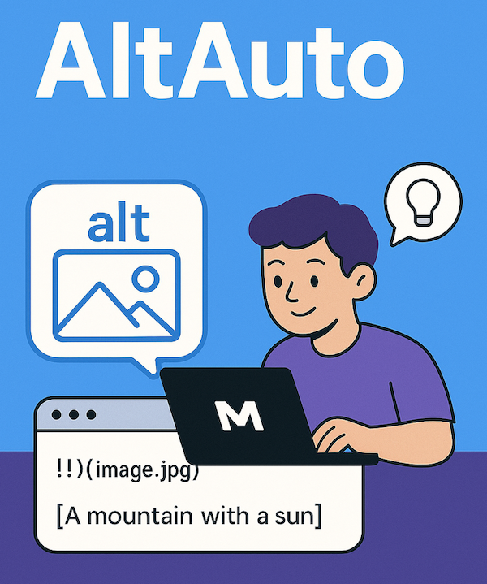

# AltAuto

Automatically create and suggest alternative text for images referenced in Markdown files.



_Image credit: ChatGPT_

## Alt Text and Markdown

The [Markdown standard][md] allows alternate text to be specified using syntax like:

```md

```

Which will render into HTML as:

```html

```

That's a good example of the mechanics of including alt text, but we should create alt text that better explain what's in the picture. With the help of AI, here are some better options for that image example:

- A scenic landscape featuring snow-capped mountains under a clear blue sky, with a foreground of rolling hills covered in golden foliage and a rustic wooden fence.
- Snow-capped mountains rise above a field of yellow flowers with a wooden fence in the foreground. The sky is clear and blue.
- A scenic landscape featuring snow-capped mountains in the background, a clear blue sky, and a wooden fence in the foreground with lush greenery and yellow flowers.

There are many good resources on the value of alt text and how to write effective descriptions. Here are a couple of good starting points:

- [WebAIM: Alternative Text][aim]
- [MDN: Img alt attribute][mdn]

## The Plan

The plan is to build a working example that could be adopted for Markdown sites such as blogs, websites or documentation.

Components:

- Script or library which uses an AI model to analyze an image and suggest alt text
  - Research and experimenting on a good model + prompt that works well
  - Make it easy to change the model and prompt
- Script to read all Markdown .md files in the project, find any image references without alt text, and run the generator script to add it
- GitHub action to run the above automatically and, if any changes made, create a pull request to bring in the alt text additions

### check-files.py

```sh
$ python check-files.py --path ~/repos/cantoni.org/content/blog/2020/
Searching for markdown files in: /Users/brian/repos/cantoni.org/content/blog/2020
Found 7 markdown file(s).

File: /Users/brian/repos/cantoni.org/content/blog/2020/01/23/barcode-scanning-video-games-collection/index.md
Missing alt text line 26: 
```

### GitHub action

create_pull_request action: https://github.com/peter-evans/create-pull-request/blob/main/docs/examples.md

## Prompts to Test

https://dri.es/comparing-local-llms-for-alt-text-generation

1. You are a helpful alt-text generator assisting visually impaired users. Generate a clear and concise caption (15-30 words) that highlights the most important subject and action. Focus only on essential details, avoiding unnecessary background elements. Use simple, everyday language and avoid overly descriptive or poetic words.
2. What’s in this image? Be brief, it's for image alt description on a social network. Don't write in the first person.
3. You write alt text for any image pasted in by the user. Alt text is always presented on a single line so it can be used easily in Markdown images. All text on the image (for screenshots etc) must be exactly included. A short note describing the nature of the image itself should go first.

## LLM Commands

https://simonw.substack.com/p/run-prompts-against-images-audio

```
llm "describe this image" -a images/CoachCathy.png
```

Next: try with ollama local models

## TODO

How to not recreate alt text for existing PRs not merged yet.

Caching LLM results per image to avoid repeated requests?

To start, limit to just a couple images.

[md]: https://www.markdownguide.org/basic-syntax/#images-1
[aim]: https://webaim.org/techniques/alttext/
[mdn]: https://developer.mozilla.org/en-US/docs/Web/API/HTMLImageElement/alt#usage_notes
